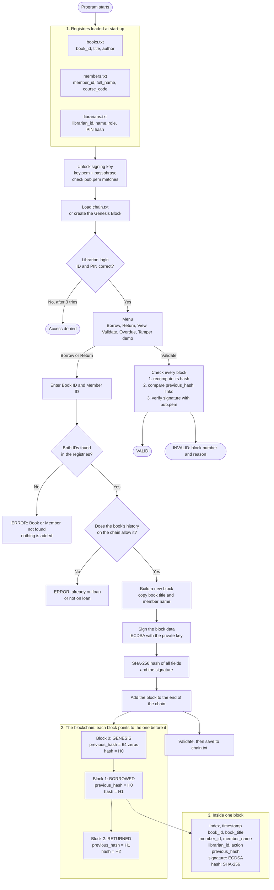

# Blockchain-Based Library Book Lending Tracker

**DemoVideo**: _https://youtu.be/YUA85d7KCy0_
| File Name | Link | Purpose of the file |
| :---- | :---- | :---- |
| DemoVideo formative | [**DemoVideo**](https://youtu.be/YUA85d7KCy0)  | complete explanation of the entire project , and complete guard on how to run it | 
| Blockchain.c | [**blockchain.c**](https://github.com/josep-prog/formative_introduction_blockchain/blob/main/src/blockchain.c)  | I created this file to manage the blockchain. It creates the genesis, borrowing and returning blocks, links them using hashes, checks active loans, validates the blockchain (hashes, links and signatures), and saves and loads the chain file. |
| Blockchain.h | [**blockchain.h**](https://github.com/josep-prog/formative_introduction_blockchain/blob/main/src/blockchain.h)  | I created this file to define the Block structure and declare the blockchain functions so that other files, especially main.c, can use them. |
| Crypto.c | [**crypto.c**](https://github.com/josep-prog/formative_introduction_blockchain/blob/main/src/crypto.c)  | I created this file to handle the security part of the system. It generates keys, saves and loads the passphrase-encrypted key file, creates and verifies digital signatures, and hashes librarian PINs using OpenSSL. |
| Crypto.h | [**crypto.h**](https://github.com/josep-prog/formative_introduction_blockchain/blob/main/src/crypto.h)  | I created this file to declare the cryptographic functions so that main.c and blockchain.c can use the security functions from crypto.c |
| Main.c | [**main.c**](https://github.com/josep-prog/formative_introduction_blockchain/blob/main/src/main.c)  | I created this file to control the whole program. It handles the menu and calls the other files when the program needs to load records, create blockchain transactions, or perform security checks. |
| Registry.h | [**registry.h**](https://github.com/josep-prog/formative_introduction_blockchain/blob/main/src/registry.h)   | I created this file to define the Book, Member and Librarian structures and declare the registry functions used by main.c. |
| Registry.c | [**registry.c**](https://github.com/josep-prog/formative_introduction_blockchain/blob/main/src/registry.c)  | I created this file to load the books, members and librarians from the data files, report any bad lines, and find a record by ID. |
| Books.txt | [**books.txt**](https://github.com/josep-prog/formative_introduction_blockchain/blob/main/data/books.txt)  | This file is for storing the registered books, including their IDs, titles, and authors. |
| Members.txt | [**members.txt**](https://github.com/josep-prog/formative_introduction_blockchain/blob/main/data/members.txt)  | this file to store the registered library members and their basic information. |
| Librarians.txt | [**librarians.txt**](https://github.com/josep-prog/formative_introduction_blockchain/blob/main/data/librarians.txt) | this file stores the staff who can log in: their ID, name, role (ADMIN or LIBRARIAN) and a PBKDF2 hash of their PIN. |
| Makefile | [**Makefile**](https://github.com/josep-prog/formative_introduction_blockchain/blob/main/Makefile) | this file to make compiling the whole project easier by providing the commands needed to build the program and link OpenSSL. |

**Technical Report: Individual Assignment 1**
**Student:** Joseph Nishimwe · African Leadership University
**Demo video:** https://youtu.be/YUA85d7KCy0
**Repository:** https://github.com/josep-prog/formative_introduction_blockchain

## Contents

1. [Introduction](#1-introduction)
2. [Project files](#2-project-files)
3. [Build and run](#3-build-and-run)
4. [Description of the blockchain implementation](#4-description-of-the-blockchain-implementation)
5. [Security mechanisms](#5-security-mechanisms)
6. [Data persistence](#6-data-persistence)
7. [Error handling strategy](#7-error-handling-strategy)
8. [Screenshots of application execution](#8-screenshots-of-application-execution)
9. [Testing](#9-testing)
10. [Challenges encountered and solutions](#10-challenges-encountered-and-solutions)
11. [System design diagram](#11-system-design-diagram)
12. [Limitations](#12-limitations)
13. [Conclusion](#13-conclusion)


I divided the program into different parts so that each part has a clear responsibility. The main.c file controls what the user sees and connects the other parts of the program. The registry.c file is responsible for loading and searching for books and members. The blockchain.c file contains the main blockchain logic, such as creating blocks, connecting them, checking borrowing status, calculating hashes, and validating the chain. The crypto.c file handles the digital signatures and the creation of the cryptographic key. This separation makes the program easier to understand because the code that deals with books and members is kept separate from the code that deals with the blockchain and cryptography.
---

## 1. Introduction

A library needs to know which books are out, who has them, and when they come back. Usually this is kept in a paper log or a normal database. The problem is that these records are easy to change. A librarian could quietly mark a lost book as "returned", or a borrower could say the log is wrong, and nobody could prove what really happened.

In this project I built a small library lending system in the C language that solves this problem with a blockchain. Every time a book is borrowed or returned, the program writes a new record called a block. Each block is locked to the block before it with a SHA-256 hash, and each block is signed with a digital signature. Because of this, if anyone changes an old record, the program can detect it.

The program runs in the terminal. A librarian logs in, and then can borrow a book, return a book, view all records, check that the chain is still valid, mark overdue loans, and (as an admin) run a demonstration of tamper detection.

## 2. Project files

| File | Purpose |
| :---- | :---- |
| [src/main.c](src/main.c) | Controls the whole program. It shows the menu, handles the login, and calls the other files to load records, create blocks and run security checks. |
| [src/blockchain.c](src/blockchain.c) | Manages the blockchain. It creates the genesis, borrow, return and overdue blocks, links them with hashes, finds active loans, validates the chain (hashes, links and signatures), and saves and loads the chain file. |
| [src/blockchain.h](src/blockchain.h) | Defines the `Block` structure and declares the blockchain functions. |
| [src/crypto.c](src/crypto.c) | Handles security with OpenSSL. It generates the key pair, saves and loads the encrypted private key and the public key, signs and verifies blocks, and hashes librarian PINs. |
| [src/crypto.h](src/crypto.h) | Declares the cryptographic functions. |
| [src/registry.c](src/registry.c) | Loads books, members and librarians from the data files, reports bad lines, and finds a record by ID. |
| [src/registry.h](src/registry.h) | Defines the `Book`, `Member` and `Librarian` structures. |
| [data/books.txt](data/books.txt) | The book registry: ID, title, author. |
| [data/members.txt](data/members.txt) | The member registry: ID, full name, course code. |
| [data/librarians.txt](data/librarians.txt) | Staff who can log in: ID, name, role (ADMIN or LIBRARIAN) and a PBKDF2 hash of their PIN. |
| [Makefile](Makefile) | Builds the program and links OpenSSL with one command. |

These files are created when the program runs. They are listed in `.gitignore` and are not committed:

| File | Purpose |
| :---- | :---- |
| `data/chain.txt` | The saved blockchain, one block per line. |
| `data/key.pem` | The private signing key, encrypted with a passphrase. |
| `data/pub.pem` | The public key, used to check signatures. |

## 3. Build and run

### Required libraries and dependencies

| Dependency | Why it is needed |
| :---- | :---- |
| `gcc` | C compiler (the code is C11). |
| `make` | Runs the build steps in the Makefile. |
| OpenSSL 3 (`libssl-dev`) | SHA-256 hashing, ECDSA signatures, AES key encryption and PBKDF2 PIN hashing. |

On Ubuntu or Debian, install all of them with:

```bash
sudo apt install gcc make libssl-dev
```

### Compilation

```bash
git clone https://github.com/josep-prog/formative_introduction_blockchain.git
cd formative_introduction_blockchain
make clean && make
```

This compiles all the source files into one program called `library`. The Makefile runs:

```bash
gcc -Wall -Wextra -std=c11 -o library src/main.c src/blockchain.c src/crypto.c src/registry.c -lssl -lcrypto
```

### Running

| Command | What it does |
| :---- | :---- |
| `./library` | Starts the program. It asks for the key passphrase and a librarian login, then shows the menu. |
| `./library --verify` | Checks `data/chain.txt` using only the public key in `data/pub.pem`. It needs no passphrase and no login, so anyone can check the records. |
| `./library --hash-pin LIB003 4321` | Prints the PIN hash to put in a new line of `data/librarians.txt`. |

The signing key in `data/key.pem` is encrypted with a passphrase of at least 4 characters. The program asks for it at start-up, or reads it from the `LIBRARY_KEY_PASSPHRASE` environment variable. The first run creates the key with whatever passphrase you give, and later runs must use the same one.

If you ran an older version of this program, delete the old files first, because the chain format changed:

```bash
rm -f data/chain.txt data/key.pem data/pub.pem
```

### Test data

**Librarians (logins):**

| ID | Name | Role | PIN |
| :---- | :---- | :---- | :---- |
| LIB001 | Joseph Nishimwe | ADMIN | 1234 |
| LIB002 | Librarian | LIBRARIAN | 5678 |


**Books:**

| ID | Title | Author |
| :---- | :---- | :---- |
| BK001 | The Money Trap: Lost Illusions Inside the Tech Bubble | Alok Sama |
| BK002 | Wars Guns & Votes: Democracy in Dangerous Places | Paul Collier |
| BK003 | Sustainable Leadership | Clarke Murphy |
| BK004 | Ancient Philosophy: The Fundamentals | Daniel W. Graham |
| BK005 | Gulliver's Travels and Other Writings | Jonathan Swift |

**Members:**

| ID | Name | Course |
| :---- | :---- | :---- |
| ALU001 | Irakoze Jean | BSE |
| ALU002 | Joseph Habimana | BSE |
| ALU003 | Uwase Diane | BEL |
| ALU004 | Manzi Eric | BSE |
| ALU005 | Mukamana Alice | BEL |

## 4. Description of the blockchain implementation

### 4.1 How the code is organised

I split the program into four parts so that each part has one job. `main.c` shows the menu and connects everything. `registry.c` loads the books, members and librarians and finds a record by its ID. `blockchain.c` creates blocks, links them together, checks the chain and saves it to a file. `crypto.c` does all the cryptography: making keys, signing, checking signatures and hashing PINs. Keeping these apart makes the program easier to read, because the code for books and members is separate from the code for the blockchain and cryptography.

### 4.2 The book and member registries

When the program starts, it reads `books.txt` and `members.txt` into arrays of `Book` and `Member` structs. Each line has three fields separated by commas. If a file is missing or has no usable lines, the program prints an error and stops. A bad line (a missing field, a field that is too long, a duplicate ID or a `|` character) is reported with its line number and skipped. Windows line endings are handled too.

These registries are the first check. Before any block is created, the program looks up the book ID and the member ID. If either one is not in the registry, it prints `ERROR: Book or Member not found` and nothing is added to the chain. The match is exact, so an ID like `BK001X` is not accepted as `BK001`.

### 4.3 The block

Each lending event is stored in one block:

| Field | Type | What it holds |
| :---- | :---- | :---- |
| `index` | `int` | Position of the block in the chain. The first block is 0. |
| `timestamp` | `time_t` | The time the block was created. |
| `book_id`, `book_title` | `char[20]`, `char[80]` | The book. The title is copied from the registry at that moment. |
| `member_id`, `member_name` | `char[20]`, `char[50]` | The member. The name is copied from the registry at that moment. |
| `librarian_id` | `char[20]` | The librarian who recorded the action (my own addition). |
| `action` | `char[10]` | `BORROWED`, `RETURNED` or `OVERDUE` (`GENESIS` for block 0). |
| `previous_hash` | `char[65]` | The hash of the block before this one. |
| `signature` | `unsigned char[72]` | ECDSA digital signature of the block data, stored with its length. |
| `hash` | `char[65]` | SHA-256 hash of all the fields above, including the signature. |

I copy the book title and member name into the block instead of only keeping the IDs. This way the block remembers exactly what was true at the time, even if the registry file changes later.

### 4.4 The genesis block and the chain

The chain always starts with a genesis block. It has index 0, the action `GENESIS`, and a previous hash made of 64 zeros, because there is no block before it. Every block after that stores the hash of the block before it in its `previous_hash` field. This is what makes it a chain:

```
Genesis → Borrow → Return → Borrow → Return
```

If one old block changes, its hash changes, and the next block no longer points to it correctly.

### 4.5 Borrowing a book

The librarian types a book ID and a member ID. The program checks both IDs in the registries. Then it checks if the book is already on loan, using `find_active_borrow()`. This function reads the chain from the newest block backwards and finds the last record for that book. If the last record is `BORROWED` (or `OVERDUE`), the book is still out and the program refuses. The blockchain itself is used to know the current state of each book, so no separate list is needed. If the book is free, the program calls `create_lending_block()`, which builds a new `BORROWED` block, signs it and calculates its hash. The block is added to the end of the chain and the chain is saved.

### 4.6 Returning a book

For a return, the program again checks both IDs. It then looks for the book's active `BORROWED` block. If there is none, because the book was never borrowed or was already returned, it prints an error. I also added one more rule: the member returning the book must be the member who borrowed it. If everything is correct, a `RETURNED` block is created with the member details from the original borrow block, then signed, hashed, added and saved.

### 4.7 Overdue loans

Menu option 5 looks at every book. If its last record is `BORROWED` and it is older than the loan period (14 days by default), the program adds an `OVERDUE` block. The book stays on loan until it is returned. A loan is only marked overdue once. For the demo, the loan period can be shortened with the `LOAN_PERIOD_SECONDS` environment variable.

### 4.8 Validating the chain

The function `validate_chain()` answers one question: **has anything been changed?** For every block it checks that:

1. the index matches the block's position,
2. the stored hash is the same as a freshly calculated hash,
3. the `previous_hash` matches the hash of the block before, and
4. the digital signature is valid (checked with the public key).

It also checks that block 0 is a real genesis block. If any check fails, the program prints which block failed and why. The hash is recalculated on a copy of the block, so validation never changes the chain it is checking.

### 4.9 Tamper detection

Option 6 (ADMIN only) shows tamper detection. It changes the book title in block 1 to `TAMPERED TITLE` in memory, without updating the hash or signature, and then validates the chain. The validation fails and reports block 1. The change is only made in memory, and the program never saves a chain that fails validation, so the file on disk stays clean. Restarting the program reloads the clean chain.

Tampering can also be shown by editing `data/chain.txt` in a text editor. The next time the program starts, or when `./library --verify` is run, it reports that the chain is invalid.

## 5. Security mechanisms

### 5.1 SHA-256 hashing

A hash is like a fingerprint for data. SHA-256 turns any data into a 64-character code. If even one letter of the data changes, the code becomes completely different. `create_transaction_data()` joins all the fields of a block together in a fixed order, and `calculate_hash()` runs SHA-256 over them and the signature. This hash is stored in the block, and the next block stores it as its previous hash. This is how the blocks are linked and how changes are detected.

### 5.2 Digital signatures (ECDSA)

Hashing shows that data has changed, but someone who changes a block could also calculate a new hash. Digital signatures stop this. The first time the program runs, `generate_key_pair()` creates a key pair on the P-256 curve using OpenSSL. The private key signs each lending block with `sign_data()`. The public key checks the signature with `verify_signature()`. Without the private key, nobody can make a valid signature for a changed block, so a rewritten block is caught even if its hash was updated.

The private key is saved in `data/key.pem`. It is encrypted with AES-256 using a passphrase, and the file can only be read by its owner. So a copy of the file alone is not enough to sign blocks.

The public key is saved separately, without encryption, in `data/pub.pem`. The program uses **only** this public key when it checks signatures, so checking the records never needs the secret key. Anyone can run `./library --verify` to check the whole chain without a passphrase or login. When the program starts, it also checks that `pub.pem` really belongs to the signing key, and stops if it does not.

### 5.3 Librarian login and roles

Before the menu appears, a librarian must log in with an ID and a PIN. The PINs are never stored as plain text. `librarians.txt` stores a PBKDF2-HMAC-SHA256 hash of each PIN, calculated 100,000 times and salted with the librarian ID, which makes guessing slow. The PIN is hidden while it is typed, and the comparison is done in constant time. After three wrong tries, the program prints "Access denied." and closes.

Each librarian has a role. A LIBRARIAN can borrow, return, view, validate and mark overdue loans. Only an ADMIN can run the tamper demonstration. The ID of the logged-in librarian is written into every block and is covered by the signature, so each block shows who recorded it.

## 6. Data persistence

All data is stored in plain text files in the `data` folder. The registries (`books.txt`, `members.txt`, `librarians.txt`) are read at start-up. The blockchain is stored in `chain.txt`, with one block per line and the fields separated by `|`:

```
index|timestamp|book_id|book_title|member_id|member_name|librarian_id|action|previous_hash|signature_hex|hash
```

The signature is written as hexadecimal text. The chain is saved after every borrow, return or overdue action, so no records are lost when the program closes. To avoid a broken file if the program crashes while saving, `save_chain()` first writes to a temporary file and then renames it over the real file. Renaming is a single step, so the file is either the old version or the new version, never half written.

When the program starts, `load_chain()` reads `chain.txt` and the chain is validated straight away. If the file does not exist, a new chain with a genesis block is created. The keys are also kept between runs, so old signatures can still be checked.

## 7. Error handling strategy

My approach is simple: **check everything before changing anything, and never leave the chain in a bad state.**

| Situation | What the program does |
| :---- | :---- |
| `books.txt` or `members.txt` missing or empty | Prints an error and stops. |
| A bad line in a registry file | Prints a warning with the line number and skips the line. |
| Unknown book ID or member ID | Prints `ERROR: Book or Member not found`. No block is added. |
| Borrowing a book that is already out | Prints an error. No block is added. |
| Returning a book that is not on loan, or by the wrong member | Prints an error. No block is added. |
| Wrong passphrase or wrong PIN | Prints an error. After three wrong PINs, access is denied. |
| `pub.pem` does not match the signing key | Prints an error and stops. |
| `chain.txt` cannot be read | Prints an error and stops, so a damaged file is not overwritten. |
| `chain.txt` was tampered with | Prints a warning with the bad block and the reason. An invalid chain is never saved. |
| Letters typed where a number is expected | Prints "Invalid choice." and shows the menu again. |
| Input closed (for example Ctrl+D) | Exits cleanly instead of looping. |
| Chain reaches its maximum size (1000 blocks) | Prints an error and refuses new blocks. |

Input is always read one full line at a time, and every text field is checked against its maximum size before it is copied. This stops long input from overflowing a buffer or spilling into the next question.

## 8. Screenshots of application execution

**1. Start-up.** The program loads 5 books, 5 members and 2 librarians, unlocks (or creates) the signing key, loads the saved blockchain (or starts a new one with the genesis block), and asks the librarian to log in.


**2. The menu.** Seven options: borrow, return, view records, validate, mark overdue loans, tamper demo and exit.


**3. Borrowing and returning.** Every successful borrow or return is added as a signed block and saved to `data/chain.txt` straight away. Unknown IDs, a book that is already on loan, a return for a book that is not on loan, or a return by the wrong member print an ERROR and add nothing.


**4. Validation and tamper detection.** Option 4 prints "Blockchain is VALID" for an untouched chain. After option 6 changes Block #1, validation prints "Blockchain is INVALID - tampering detected!" with the block number and the reason.


**5. Checking the chain with only the public key (`./library --verify`).**

<!-- Add screenshot here -->

**6. Error when `books.txt` or `members.txt` is missing or empty.**

<!-- Add screenshot here -->

## 9. Testing

The blockchain is saved between runs, so run `rm -f data/chain.txt` before each command below to start from a clean chain. First set the passphrase once with `export LIBRARY_KEY_PASSPHRASE=demo-pass`. Every command starts by logging in as `LIB001` with PIN `1234`.

| Command | What it checks |
| :---- | :---- |
| `printf 'LIB001\n0000\nLIB001\n0000\nLIB001\n0000\n' \| ./library` | A wrong PIN three times prints "Access denied." and exits. |
| `printf 'LIB001\n1234\n1\nBK001\nALU001\n7\n' \| ./library` | A normal borrow works. |
| `printf 'LIB001\n1234\n1\nBK001\nALU001\n1\nBK001\nALU002\n7\n' \| ./library` | A book that is already on loan cannot be borrowed again. |
| `printf 'LIB001\n1234\n1\nBK999\nALU001\n1\nBK001\nALU999\n7\n' \| ./library` | An unknown book and an unknown member are both rejected with "ERROR: Book or Member not found". |
| `printf 'LIB001\n1234\n1\nBK001\nALU001\n2\nBK001\nALU002\n2\nBK001\nALU001\n7\n' \| ./library` | Only the member who borrowed a book can return it. |
| `printf 'LIB001\n1234\n2\nBK001\nALU001\n7\n' \| ./library` | Returning a book that was never borrowed prints an error. |
| `printf 'LIB001\n1234\n1\nBK001\nALU001\n5\n3\n7\n' \| LOAN_PERIOD_SECONDS=0 ./library` | An OVERDUE block is added and shown with a VALID signature. |
| `printf 'LIB001\n1234\n1\nBK001\nALU001\n6\n4\n7\n' \| ./library` | Tampering is detected and stays detected. |
| `printf 'LIB002\n5678\n6\n7\n' \| ./library` | A LIBRARIAN cannot run the tamper demo; only an ADMIN can. |
| `printf 'LIB001\n1234\nabc\n7\n' \| ./library` | Letters in the menu are ignored and the program does not crash. |
| `printf '' \| ./library` | The program exits cleanly when there is no input. |
| `./library --verify` | The saved chain is checked with only the public key. |

**Test results:**


## 10. Challenges encountered and solutions

**Validation was changing the data it checked.** At first, to check a block, I recalculated its hash directly on the block. This overwrote the stored hash, so a changed block could look correct. I fixed this by recalculating the hash on a copy of the block and comparing the copy with the original. Now validation only reads the chain and never changes it.

**Signatures do not always have the same length.** An ECDSA signature is usually 70 to 72 bytes, not a fixed size. If the program always read 72 bytes, it would check extra bytes that are not part of the signature, and verification would fail. I solved this by storing the real length of each signature next to it, and by refusing any signature longer than 72 bytes.

**Records and keys were lost between runs.** In my first version, the chain was only kept in memory and a new key was made every time the program started. When the program closed, all records were gone, and old signatures could not be checked with the new key. I now save the chain to `chain.txt` after every action, and I save the key to a file and load it again on the next run. To protect it, the key file is encrypted with a passphrase and only the owner can read it.

**Checking the chain needed the secret key.** The program first took the public key from the encrypted private key file, so nobody could check the records without the passphrase. I fixed this by saving the public key in its own file, `pub.pem`, and using only that file for checking. I also added `./library --verify` so anyone can check the chain.

**A crash while saving could break the chain file.** If the program stopped in the middle of writing `chain.txt`, the file would be half written. I solved this by writing to a temporary file first and then renaming it, which happens in one step.

**The tamper demo could damage the real records.** Once I added saving, there was a new risk: after the demo changed a block, the next save would have written the tampered chain to disk. I solved this by making the program validate the chain before every save and refuse to save an invalid chain.

**Special characters in the data files.** The chain file uses `|` to separate fields, so a title containing `|` would break it. The registry loader now rejects such lines. It also removes extra spaces and handles Windows line endings.

## 11. System design diagram

The diagram shows three things. First, how the registries are loaded at start-up and used to check every book ID and member ID before a block is made. Second, how each block points to the block before it through its `previous_hash`, starting from the genesis block. Third, what is inside one block. It also shows the steps of the lending flow (check IDs, check the book's history, build, sign, hash, add, save) and the three checks done when the chain is validated.



## 12. Limitations

The whole chain file is rewritten after every action. This is fine for a small library but would be slow for a very large one.

There is one signing key for the whole system. The key proves that a block came from this program, and the signed librarian ID shows who made it, but separate keys for each librarian would be stronger. The genesis block is not signed, because it holds no lending data.

The PIN login protects the menu, but anyone who can edit `data/librarians.txt` could add an account. A real system would keep these files on a server that only administrators can change.

## 13. Conclusion

This project shows how a blockchain can make library records trustworthy. The registries decide which books and members are valid. The blockchain keeps a full history that is never overwritten, only added to. SHA-256 links the blocks so that any change is visible, and digital signatures prove that each block was made by the system and by a logged-in librarian. The validation step can check the whole history at any time, using only the public key.

In short: **the registry tells the system what is valid, the blockchain keeps the history, cryptography protects the records, and validation checks whether the history has been changed.**
